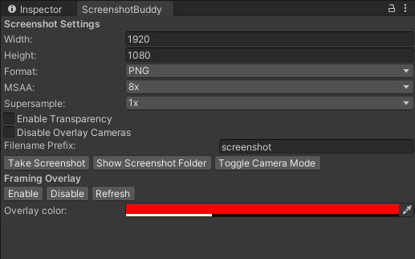

# ScreenshotBuddy
A unity editor tool to take (high res) screenshots from the scene view.
Tested and coded using Unity 2020.3 LTS.
# Features
* Screenshots directly from your scene view camera
* Freely choose the resolution
* Downsample for even better AA than the max 8x MSAA
* Save as PNG, JPG (with configurable quality) or TGA
* Save transparent screenshots (for example, in prefab view)
* Framing Overlay that takes the ratio directly from your choosen resolution

# Usage
You can find the tool under Window/ScreenshotBuddy. Position your scene view
the way you want, then set your settings and click the "Take Screenshot" button.

# Known Issues
* Enabling the Framing Overlay stops you from using the inspector properly. 
Unsure why, it seems merely registering the duringSceneGUI event causes this.

